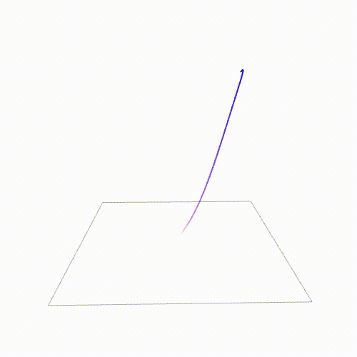
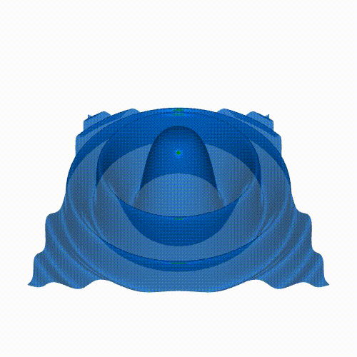
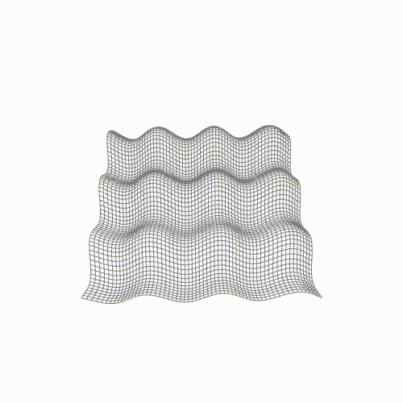
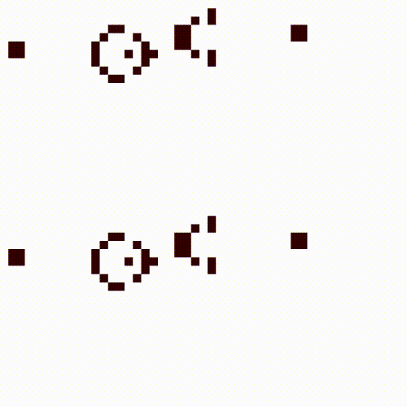

# Elementary Visualizer

Simple visualization library.

## Examples

For examples, see the [./examples](examples) directory or the [./tests](tests).

<table>
  <tr>
    <td align="center">
      
      <a href="./examples/lorenz_attractor.cpp">lorenz_attractor.cpp</a>
    </td>
    <td align="center">
      
      <a href="./examples/wave.cpp">wave.cpp</a>
    </td>
  </tr>
  <tr>
    <td align="center">
      
      <a href="./examples/wireframe.cpp">wireframe.cpp</a>
    </td>
    <td align="center">
      
      <a href="./examples/game_of_life.cpp">game_of_life.cpp</a>
    </td>
  </tr>
</table>

## Building

In the project root directory, run the following commands to build the project.

```
cmake -S . -B build
cmake --build build
```

## Running tests and automatic reformatting

To run tests, run the following command.
```
ctest --test-dir build
```

To automatically reformat the code, run the following command.
```
cmake --build build --target clangformat
```

## Credits

This project makes use of the following open-source software.

- [expected](https://github.com/TartanLlama/expected.git): Single header implementation of `std::expected` with functional-style extensions.
- [GLFW](https://www.glfw.org/): GLFW is an Open Source, multi-platform library for OpenGL, OpenGL ES and Vulkan application development.
- [glad](https://github.com/Dav1dde/glad.git): Vulkan/GL/GLES/EGL/GLX/WGL Loader-Generator based on the official specifications for multiple languages.
- [glm](https://github.com/g-truc/glm.git): Header only C++ mathematics library for graphics software.
- [FFmpeg](https://ffmpeg.org/): FFmpeg is a collection of libraries and tools to process multimedia content such as audio, video, subtitles and related metadata.

Note, the implementation of video encoding is based on the following example by Fabrice Bellard: [mux.c](https://git.ffmpeg.org/gitweb/ffmpeg.git/blob/HEAD:/doc/examples/mux.c).

## Development guidelines

* Before each commit, use the automatic code formatter.
* Use the `this->` strictly when referring to member function or variable.
* Do not check for the validity of (smart) pointers of the type
  `Expected<P, E>`, because if this returns successfully,
  assume that the pointer is also valid.
  (This also implies everything which returns this type
  should make sure that the (smart) pointer is valid in this case.)
* The validity of (smart) pointers for private member variables
  should not be checked if they are expected
  to be setup correctly inside the class.
* (Smart) pointers coming from outside (non-member)
  should be always checked.
* Use constants whenever possible.
* Everything should run in a single thread.
  This is a limitation of GLFW and OpenGL.

## Todo

* Add build requirements in readme.
* Add noexcept to functions definitions/declarations.
  Also, consider the `-fno-exceptions` option.
* Documentation.
  * Document how to use video.
    * Document how to use x264 codec (enable in FFmpeg).
    * Document how to create gifs.
    * Document how to create series of images with `Video` (filename: '%d').
  * Document the code, possibly with using doxygen.
* Video features to be optional, and document it.
* `Visual` could be improved: the `Visual::render()`
  could implement all the mandatory parts: setting the depth peeling data,
  and setting the model, view, projection matrices. And after that's done,
  it could call the current visual type's rendering implementation.
* Features.
  * Lines.
    * Texturing along the line; dashed lines.
  * Surface plot.
    * The x, y, z coordinates are specified
      in a 2 dimensional data,
      and this defines the whole surface
      (the index is the u, v coordinate).
    * Simple Phong reflection model.
    * Two modes: smooth and flat.
      * Smooth mode: colors are defined at vertices,
        normals are interpolated between vertices.
      * Flat mode: colors are defined inside rectangles,
        normals are not interpolated,
        they are constant for a half rectangle (triangle).
    * Possibly texturing.
  * Make sure the `RenderMode` works for video.
  * For video, user should be able to explictly specify
    * codecs, and
    * video format (the format context type mp4, gif, mkv, etc.).
  * Text.
    * Basic text.
    * Latex equations.
  * Rendering the rendered scene to `Image`.
  * Volumetric plot.
* Error handling.
  * Implement `Error` class correctly, and populate
    it's data correctly when it is created anywhere.
  * Functions which return `void` should return
    a value which indicates whether they succeed,
    or fail if the function can fail internally.
    The reason for failure should be returned.
  * Use `glCheckFramebufferStatus` to check framebuffer status
    when creating/using framebuffers.
* Tests.
  * Add tests for public class copy/move, and check their validity.
  * Check not only `add_visual` but also `remove_visual` in the tests.
* Use testing framework; possibly GoogleTest or Catch2.

## Licensing

This software is distributed under the GNU General Public License (GPL) version 3. You can find the full text of the license in the [LICENSE](LICENSE.txt) file.

### Other Licensing Options

Upon request, alternative licensing options may be available for this software.

